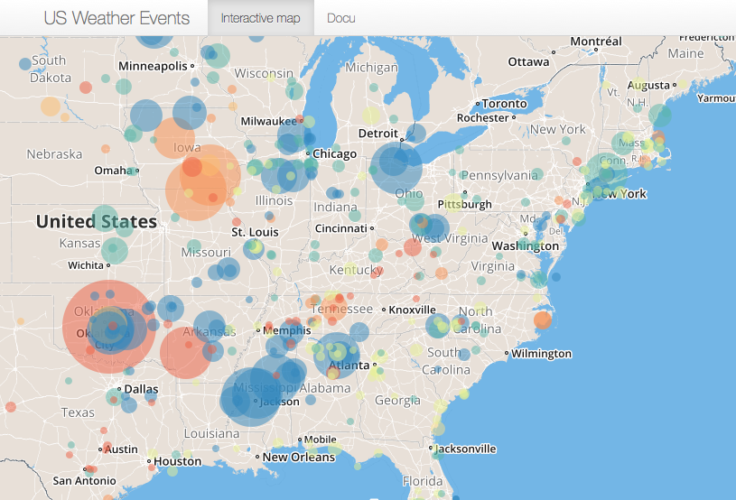
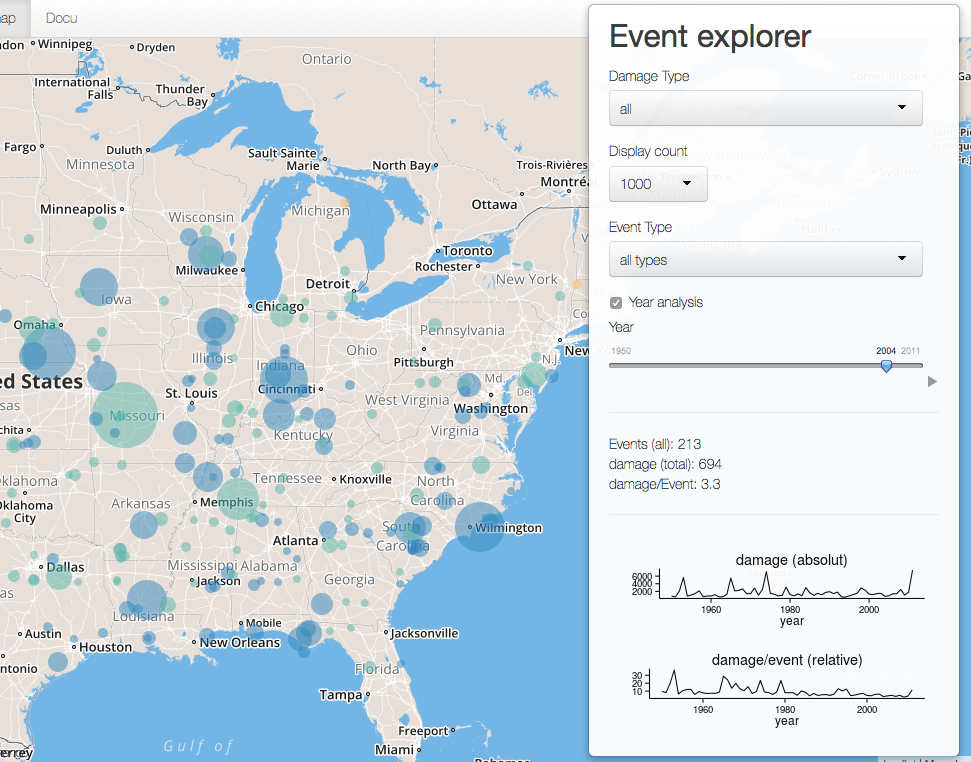
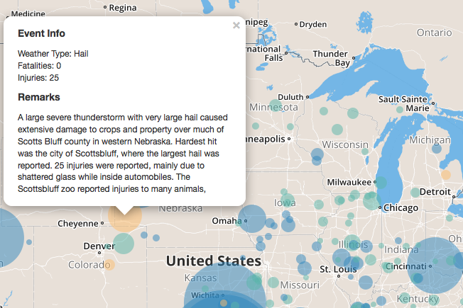

# Weather Explorer - Docu

Weather can be visious! How high the cost can be, this App intends to show you. Target area is the US. Goal is to provide indications regarding the harmfulness of different event types. These information may become usefull when prioritizing counter measurements against weather disasters. As evaluation basis, data from the he National Weather Service Institution is utilized. 

> [App URL](https://stehyr.shinyapps.io/r_shiny_WeatherEvents/)



## The Data and Layout source 

> **Data** US National Weather Service [here(PDF-file)](http://www.weather.gov/)

> **Layout** based on [SuperZip App](https://github.com/jcheng5/superzip) by [Joe Cheng](https://github.com/jcheng5)

## App Features

The App with the Interactive Map and the Event Explorer allows to explore the weather. 

### Event Explorer

he Event-explorer allows to select different event types, one or all years, the number of displayed events and the damage type. A short summary about the number of events and  relative/absolut caused damage provides a brief overview. 



Example code for drawing circles in the map, using leaflet. 

```{r,   wrapper=TRUE, eval=FALSE}
   map$addCircle(
      dataChunk$lat, 
      dataChunk$lng,
      dataChunk$effect,
      layerId = dataChunk$X,
      options=list(  
         stroke = FALSE, fill=TRUE, fillOpacity = .5),
      eachOptions = list(fillColor = dataChunk$eCol)) 
```

#### Time Lapse

Development over the years can be explored as animation (Play button under slider)

#### Event Details
 
Clicking on an Event opens a popup with details about the Event. 



The Boxes are dynamicly created

```{r, wrapper=TRUE, eval=FALSE}
      # create remarks box or info, if no remarks available
      if (nchar(focusEvent$remark) > 1 ){ 
         remarksDiv <- tags$div(
            tags$h5("Remarks"),
            tags$div( 
               style="max-height:120px;max-width:300px;border:1px;overflow:auto;",
               sprintf("%s",focusEvent$remark)))
      } else { remarksDiv <- tags$h5("no Remarks available") 
      # create content box
      content <- as.character(tagList(
         tags$h5("Event Info"),
         sprintf("Weather Type: %s", focusEvent$etype ), tags$br(),
         sprintf("Fatalities: %s", focusEvent$fatalities ), tags$br(),
         sprintf("Injuries: %s",  focusEvent$injuries ), tags$br(),
         remarksDiv))
```

## Data


### Data source 
The National Weather Service Institution (NWSI) provided 2007 the data "Storm data Preparation". A detailed description of the used data can be found [here(PDF-file)](https://d396qusza40orc.cloudfront.net/repdata%2Fpeer2_doc%2Fpd01016005curr.pdf). 

```{r,eval=FALSE}
# inital loading of local path 
data<-read.csv(file="stormData.csv",head=TRUE ) 
```
```

Detailed information are available [here(docx-file)](http://www1.ncdc.noaa.gov/pub/data/swdi/stormevents/csvfiles/Storm-Data-Export-Format.docx). The following collumns are utilized in the app: 
- EVTYPE: Event type
- FATALITIES: Number of casualties for an event.
- INJURIES: Number of injuries for an event.
- LATITUDE and LATITUDE: Event coordinates.
- BGN_DATE: Event date.
- REMARKS: Event remarks.

### Data cleaning 
With over 500MB, the initial table is to heavy and includes more information, than utilized in the app. Hence, all unnessesary data shall be removed.

#### Step 0: Loading required Libraries
```{r,eval=FALSE}
library(bitops);library(RCurl); library(downloader);   
```

#### Step 1: Extract relevant collumns
```{r,eval=FALSE}
# collumns extration 
colNames <- c("EVTYPE", "FATALITIES", "INJURIES", "LATITUDE", "LONGITUDE", "BGN_DATE", "REMARKS")
data <- data[,colNames]
````

#### Step 2: Removing of Events without injuries or casualties
```{r,eval=FALSE}
data<-data[ data$FATALITIES != 0 | data$INJURIES != 0, ]
```

#### Step 3: Formating event coordinates and removing misplaced events
```{r,eval=FALSE}
# correct latitute and longitute format
data$LATITUDE <- as.numeric(data$LATITUDE)/ 100; 
data$LONGITUDE <- as.numeric(data$LONGITUDE)/-100

# filter incorrect coordinates
data <- data[ data$LATITUDE > 10, ]; 
data <- data[ data$LATITUDE < 75, ]; 
data <- data[ data$LONGITUDE < -50, ]
````
  
#### Step 4: Formating and Generalizing of Event Labels
```{r,eval=FALSE}
# local function to change first letter of x into upper case
simpleCap <- function(x) {
     s <- strsplit(x, " ")[[1]]
     paste(toupper(substring(s, 1,1)), substring(s, 2), sep="", collapse=" ")
}

# setting all labels to lower cases. 
data$EVTYPE<-tolower(data$EVTYPE)
  
# setting first letter of labels to upper case
data$EVTYPE <- sapply( data$EVTYPE , simpleCap)

# editing event lables 
data$EVTYPE[data$EVTYPE == "Marine High Wind"]<-"Marine Strong Wind"
data$EVTYPE[data$EVTYPE == "Marine Tstm Wind"]<-"Marine Thunderstorm Wind"
data$EVTYPE[data$EVTYPE == "Tstm Wind"]<-"Thunderstorm Wind"
data$EVTYPE[grep("Waterspout", data$EVTYPE )]<-"Flood"
data$EVTYPE[grep("ornado", data$EVTYPE )]<-"Tornado"
```

#### Step 5: Formating Event Year
```{r,eval=FALSE}
# local functions to extract the year 
GetYear <- function(dateLong){ 
   dateShort<-as.Date(dateLong, "%m/%d/%Y %X")
   as.numeric(strtrim(as.character(dateShort),4)) 
}

# editing event year
data$BGN_DATE<-sapply(data$BGN_DATE,GetYear)
```


#### Step 5: Adding overall effect for each event 
```{r,eval=FALSE}
# combined damage of event
data$damage<-data$FATALITIES+data$INJURIES
```

#### Step 6: Relable collumns
```{r,eval=FALSE}
# new labels for data.frame
colnames(data) <- c("etype", "fatalities", "injuries", "lat", "lng", "year", "remark", "damage")   
```

#### Step 7: Save event data locally
```{r,eval=FALSE}
# local helpful functions
write.csv(data, file="stormData_filtered.csv")   
```